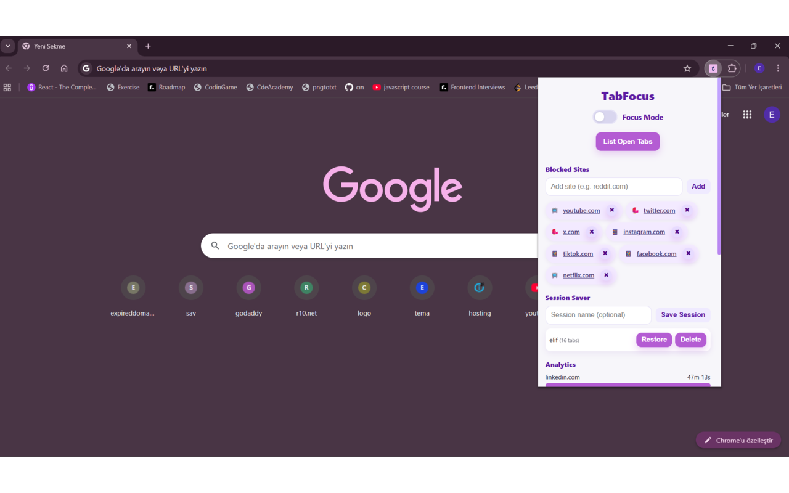
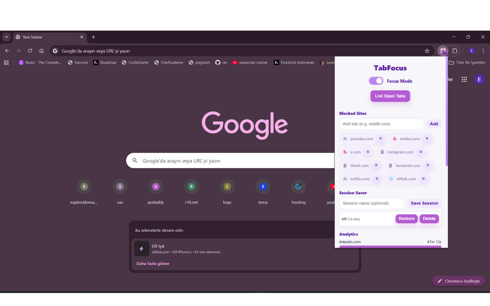
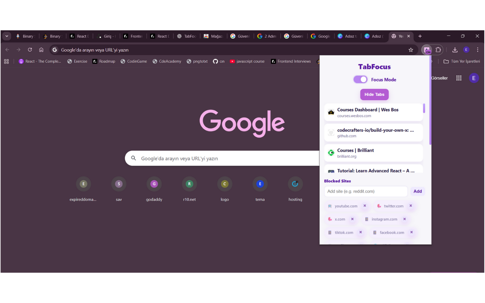
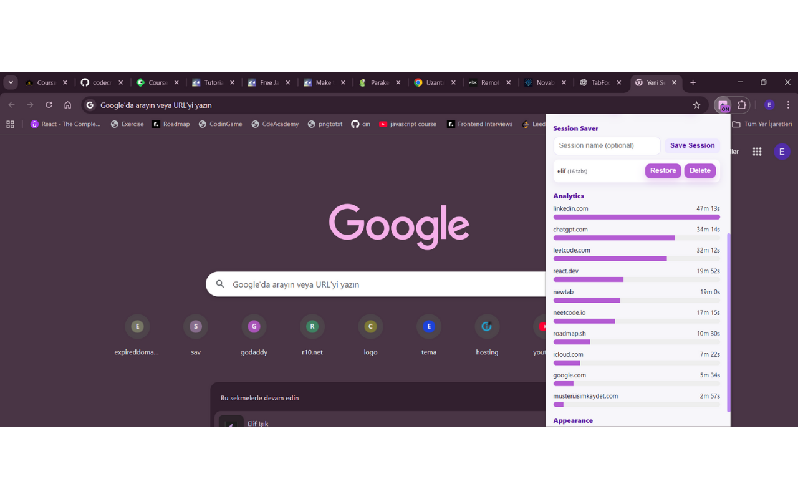
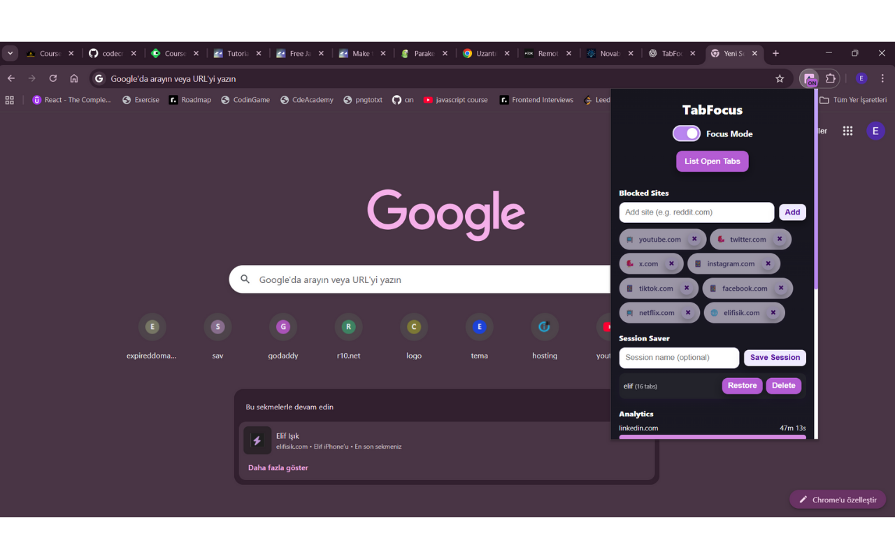

# TabFocus — Stay Focused, Block Distractions

A smart and minimal Chrome extension to help you stay focused by blocking distracting websites and saving tab sessions.
Built with HTML, CSS, and JavaScript — no user tracking, no data collection.

## Watch the full demo on YouTube:  

## Features

 Focus Mode: Block distracting sites (like YouTube, Twitter, TikTok, etc.) while working.

 Custom Block List: Add or remove your own blocked websites easily.

 Session Saver: Save your open tabs and restore them later with one click.

 Productivity Analytics: See where you spend most of your browsing time.

 Dark/Light Theme: Clean interface that adapts to your preference.

## Screenshots

**Tab Focus**  

**Focus Mode-Blocked Sites**  

**List Tabs**  

**Session Saver-Analytics View**  

**Dark Mode**  

 ## Installation

Download or clone this repository:

git clone https://github.com/eliffisik/tabfocus.git

Open chrome://extensions in your browser.

Enable Developer mode (top right).

Click Load unpacked and select the project folder.

Enjoy distraction-free browsing 

## Privacy Policy

TabFocus does not collect, transmit, or share any personal data.
All settings are stored locally using Chrome’s storage.local API.
Read the full policy here:
Read the full policy here: [Privacy Policy](./privacy-policy.md)

## Tech Stack

HTML, CSS, JavaScript

Chrome Extension Manifest V3

Chrome APIs: tabs, storage, scripting, activeTab

 ## Permissions Justification

tabs: Used to list and manage open tabs for session saving and focus mode.

activeTab: Allows activating or switching between user tabs.

storage: Saves blocked site list, theme, and focus settings locally.

scripting: Injects lightweight logic for blocking focus mode sites.

host_permissions: Needed to detect URLs of open tabs to determine if a site is blocked.

## Contact

Developed by Elif Işık
[elifisik.com](https://elifisik.com) 

 eliffisik@icloud.com

 Open-source & privacy-first.
No trackers. No ads. Just focus.
